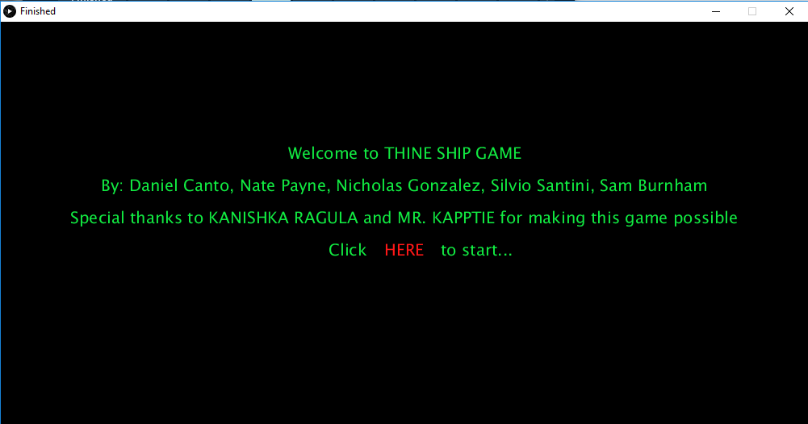
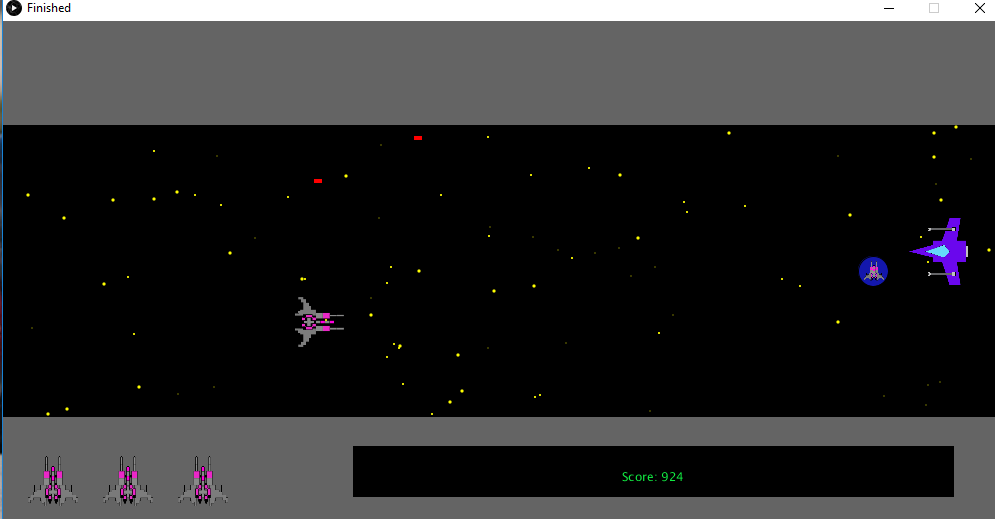
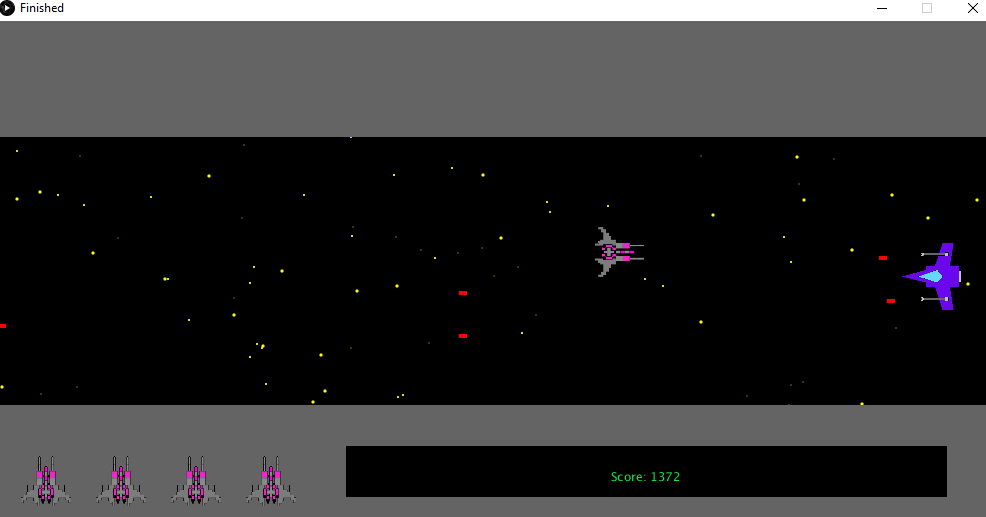
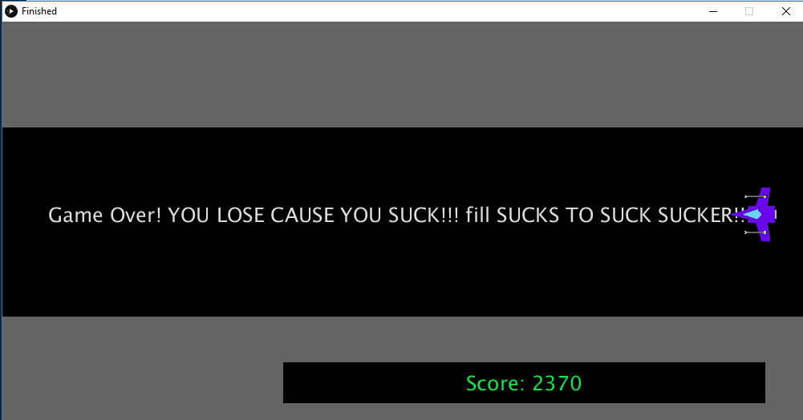
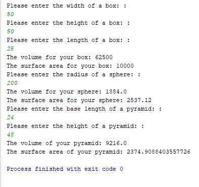

## Welcome to Anthony's Programming Portfolio

### Contact Information
Anthony Burnham
[Email Anthony Burnham](mailto:iamsamsoccer@gmail.com)

## Group Project - SpaceShip Game

### SpaceShip Game

SpaceShip Game is a game created by Daniel Canto, Nate Payne, Nicholas Gonzalez, Silvio Santini and Sam Burnham with 
special thanks to Kanishka Ragula and Mr. Kapptie.

[SpaceShip Game - Repository Link](https://github.com/Anthburn/SpaceshipGame-master)









### Sample Code Snippet
```markdown
void death() {
  background(0);
  textAlign(CENTER);
  fill(222);
  textSize(25);
  text("Game Over! YOU LOSE CAUSE YOU SUCK!!! SUCKS TO SUCK SUCKER!!!!", width/2, height/2);
  noLoop();
}
```

## Shapes Project

Shapes is a project designed to explore Classes and OO relationships.

[Shapes - Repository Link](https://github.com/Anthburn/Shapes)




### Sample Code Snippet
```markdown
public class Box {

    private int length;
    private int width;
    private int height;

    public Box(){
        this.length = 0;
        this.width = 0;
        this.height = 0;
    }

    public void setLength (int length) {
        this.length = length;
    }
    public void setWidth (int width) {
        this.width = width;
    }
    public void setHeight (int height) {
        this.height = height;
    }
    public int getLength() {
        return this.length;
    }
    public int getWidth() {
        return this.width;
    }
    public int getHeight() {
        return this.height;
    }

    public int getVolume() {
        //volume = height*width*length
        return this.height*this.width*this.length;
    }
    public int getSurfaceArea() {
        //surface area of box = 2(h × W) + 2(h × L) + 2(W × L)
        return 2*(this.height*this.width) + 2*(this.height*this.length) + 2*(this.width * this.length);
    }
}
}
```


<!--

You can use the [editor on GitHub](https://github.com/Anthburn/Programming1/edit/master/index.md) to maintain and preview the content for your website in Markdown files.

Whenever you commit to this repository, GitHub Pages will run [Jekyll](https://jekyllrb.com/) to rebuild the pages in your site, from the content in your Markdown files.

### Markdown

Markdown is a lightweight and easy-to-use syntax for styling your writing. It includes conventions for

```markdown
Syntax highlighted code block

# Header 1
## Header 2
### Header 3
- Bulleted
- List

1. Numbered
2. List

**Bold** and _Italic_ and `Code` text

[Link](url) and 
```

For more details see [GitHub Flavored Markdown](https://guides.github.com/features/mastering-markdown/).

### Jekyll Themes

Your Pages site will use the layout and styles from the Jekyll theme you have selected in your [repository settings](https://github.com/Anthburn/Programming1/settings). The name of this theme is saved in the Jekyll `_config.yml` configuration file.

### Support or Contact

Having trouble with Pages? Check out our [documentation](https://help.github.com/categories/github-pages-basics/) or [contact support](https://github.com/contact) and we’ll help you sort it out.
-->
